# DBS_Analyzer
This PC application, developed in Python, is designed to support clinicians treating patients with Deep Brain Stimulation (DBS) using the Medtronic Percept™ PC neurostimulator. It facilitates retrospective clinical and electrophysiological monitoring, biomarker extraction, and data analysis by generating detailed visual PDF reports. The application also enables the export of LFP montages and home recordings to Excel files, providing an accessible solution for research and analysis.

# Installation
1. Download the zip file from [here](https://drive.google.com/file/d/1u0fwb8m4guAEwfSod4SIQ9pQGDZl-Qb1/view?usp=drive_link).
2. Extract the contents of the ZIP folder (named "**dist**") to your preferred location on your computer.  
3. Right-click the file named **"DBS_Data_Analyzer_ver_X"** (currently version 2) and select **Create Shortcut** from the context menu.  
4. Move the shortcut to a convenient location on your computer.  
5. Launch the application by double-clicking the shortcut.  

## Usage Guide
1. Create a dedicated folder for a single patient and ensure it contains all the relevant JSON files associated with that patient.  
2. Launch the **DBS Data Analyzer** application. On the opening screen, click the **Start** button.  
   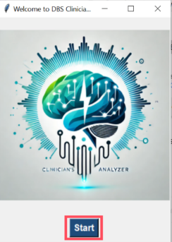
3. Select **Browse** to navigate and choose the folder containing the patient's files.  
   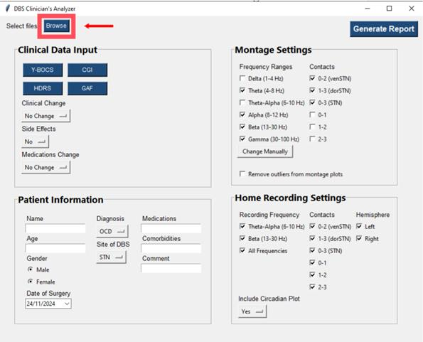
4. In the **Patient Information** section, enter the details to be saved in the clinical Excel file. During the first run on the folder, the Date of Surgery and Name fields are mandatory (names could be non-identified, i.e., patient’s number). However, in subsequent runs, the application will retain this information, and there will be no need to fill these fields again. Any data entered in the Comments and Medications fields will be included in a table presented on the last page of the PDF report which is generated by the application.  
   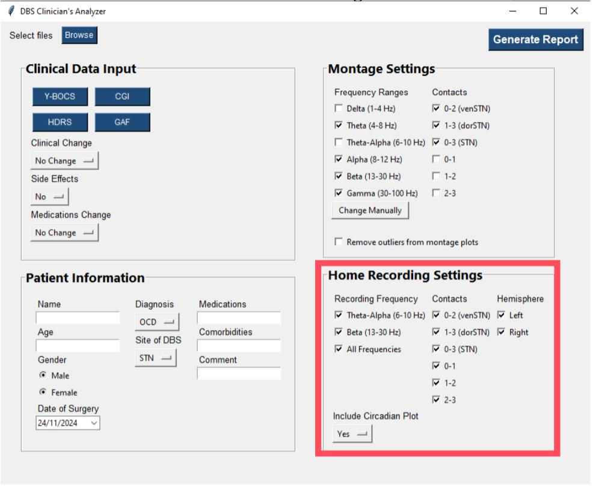
5. Clinical questionnaires (**Y-BOCS**, **CGI**, **HDRS**, **GAF**) can be directly completed by the clinician on the application. In addition, the clinical can document the current clinical status of the patient comparing to their previous medical visit (**Clinical Change**, **Side Effects**, **Medication Changes**).  
   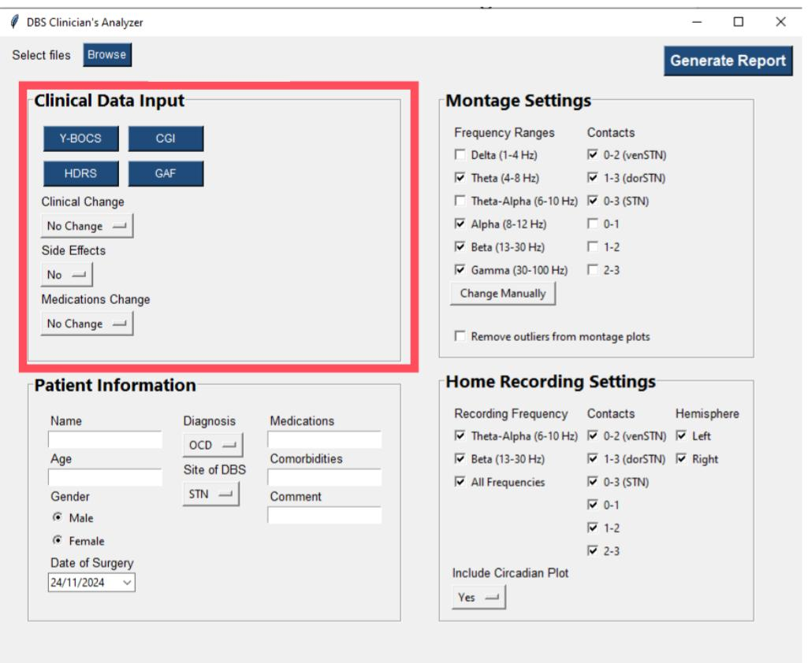
6. The clinical Excel file will be generated after the first run on the patient's folder. In case there is previous clinical data that was not documented using the application, the clinical Excel allows the clinician to add past clinical scores by filling the **Date** column and the corresponding clinical score columns.  
   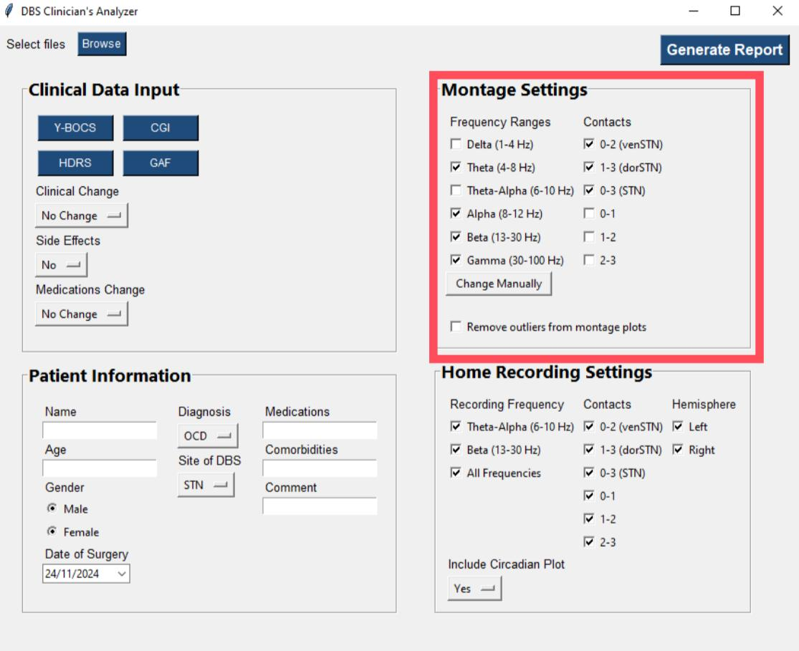
7. In the **Montage** section, the frequency ranges and DBS contacts can be selected to be included in the montage figures in the PDF report. If needed, the frequency ranges can be manually adjusted with their labels by clicking the **Change Manually** button. This allows modifying both the numerical frequency ranges and their descriptive names (labels). If after running the application, outliers are noticed in the montage figures that hinder trend visualization, outliers removal can be done by checking the box labeled **Remove outliers from montages plot**. This option will automatically clean data points that deviate by more than 3 SD from the mean, improving data visualization.  
   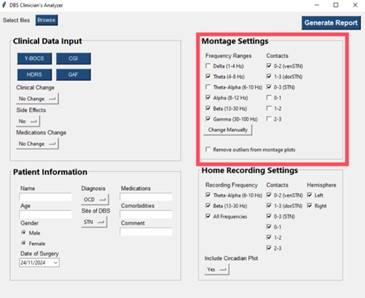
8. In the Home Recording section, recording frequency, recording contacts, and the hemisphere of interest can be selected to be included in the corresponding section of the PDF report. For figures displaying diurnal LFP patterns (mean 24-hour LFP) for the days recorded in each JSON file, the **Include Circadian Plot** field should be set to **Yes**.  
   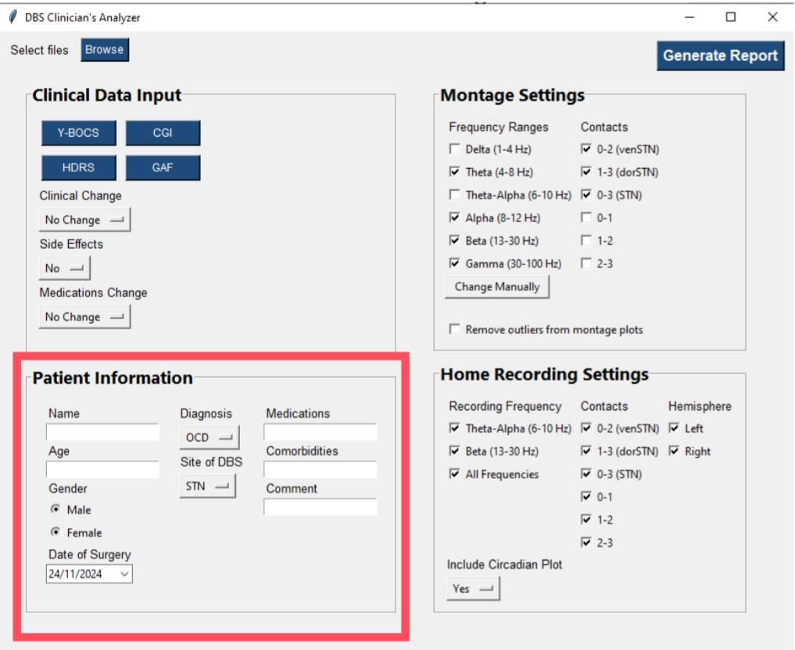
9. Click the **Generate Report** button to run the application. Wait until the progress bar appears, indicating the application is running.  
   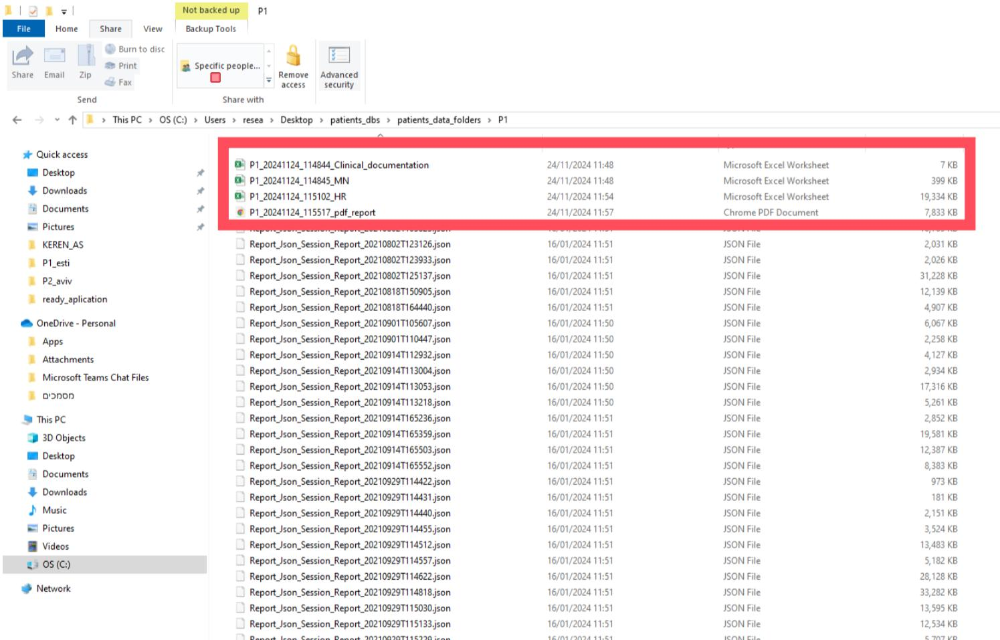  

The process is complete once the progress bar reaches the end, signaling that the PDF report containing up to 8 sections (8/8) has been successfully generated.  

10. Four output files will be created in the selected patient folder:  
   - **PDF Report**: A retrospective summary of the patient's electrophysiological and clinical state.  
   - **Clinical Excel File**: A file containing all accumulated clinical data for the patient. This file is updated during each run, ensuring there is always only one updated version in the folder.  
   - **Montages Excel File**: A file containing extracted features (both periodic and aperiodic) for each montage, hemisphere, and contact.  
   - **Home Recording Excel File**: A file including all LFP samples (recorded every 10 minutes within a defined frequency range) from all JSON files in the folder.  
   

11. The application tracks JSON files that have already been processed. During subsequent runs, the application processes only the new files in the folder that were not included in previous runs.  

## Appendix – Example of Full PDF Report  
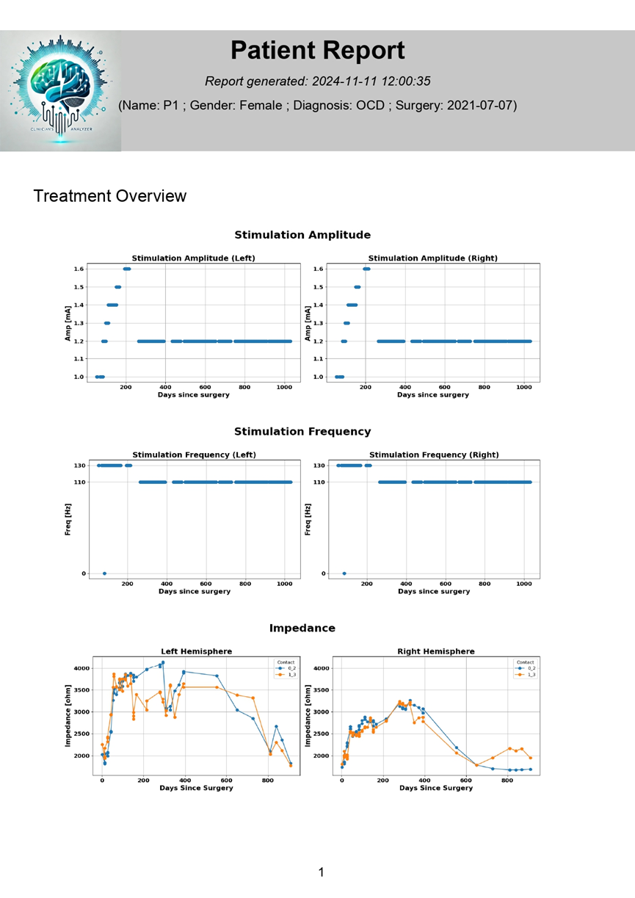  
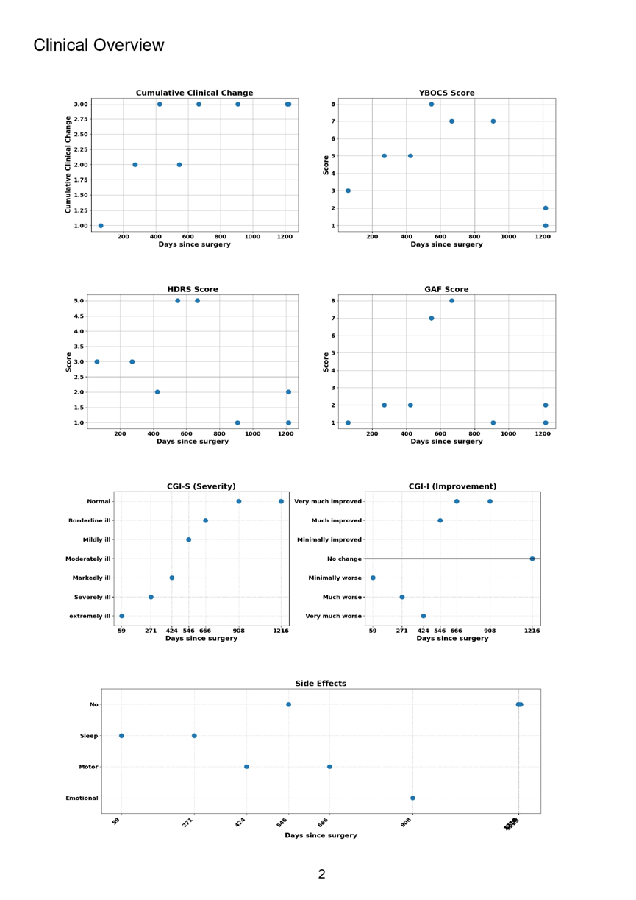  
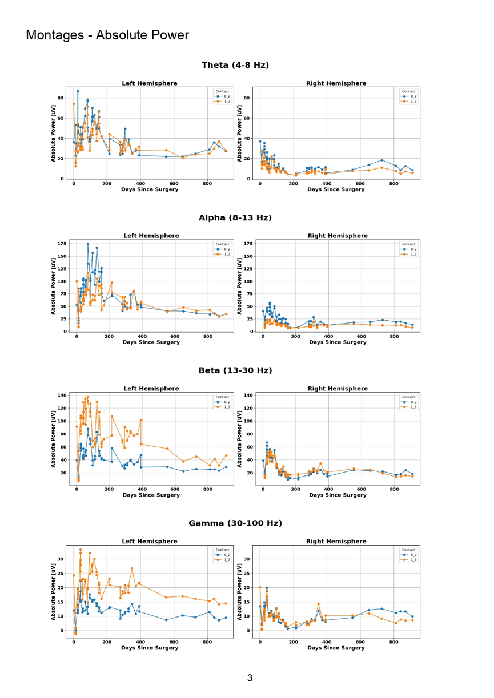  
  
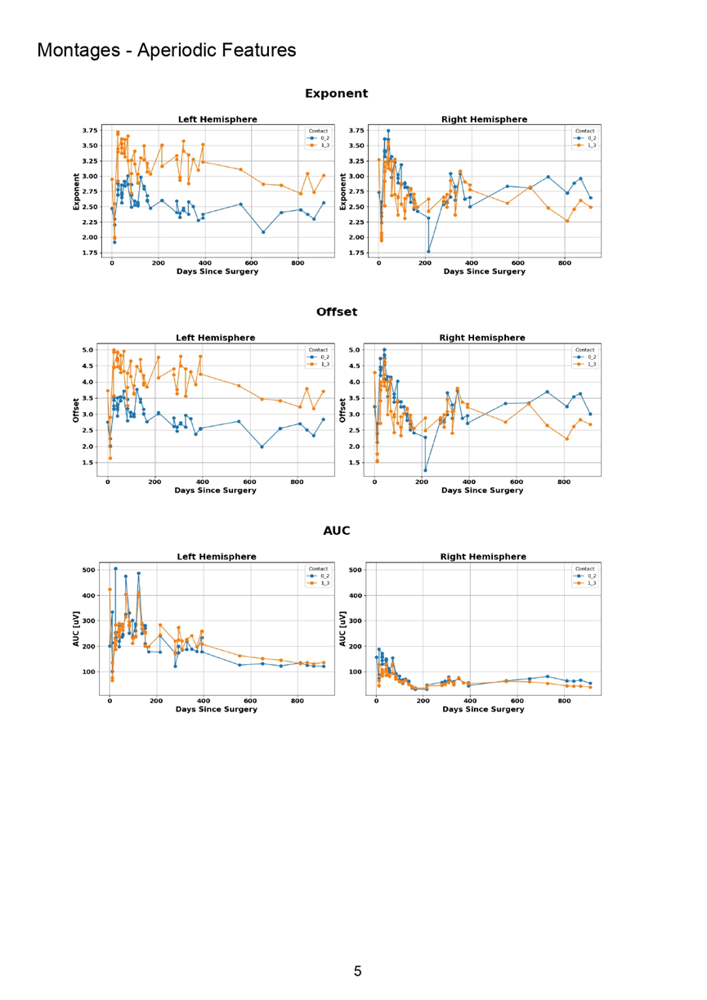  
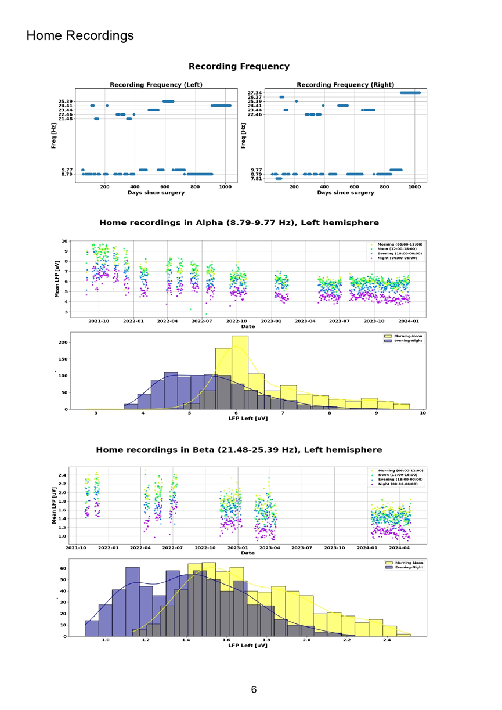  
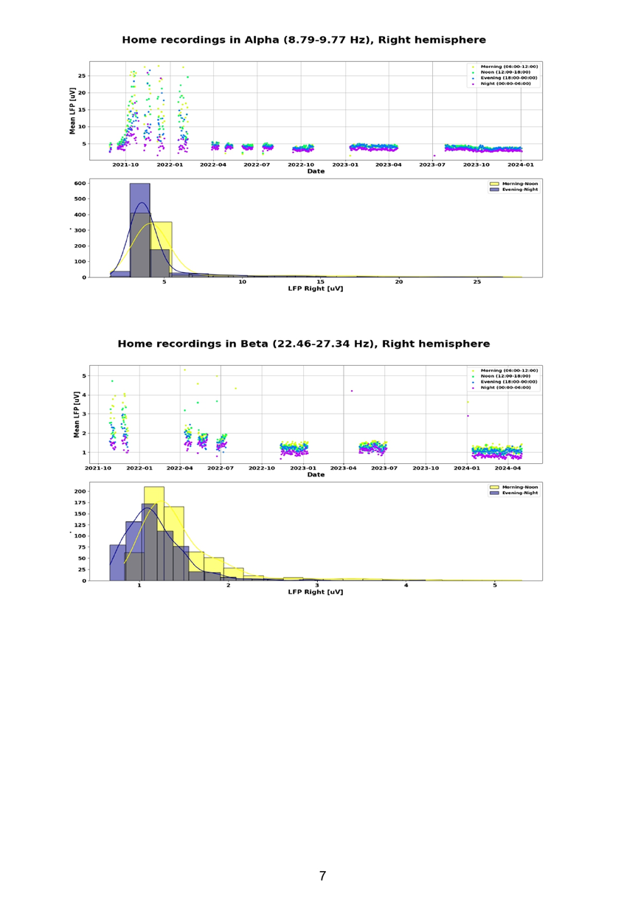  
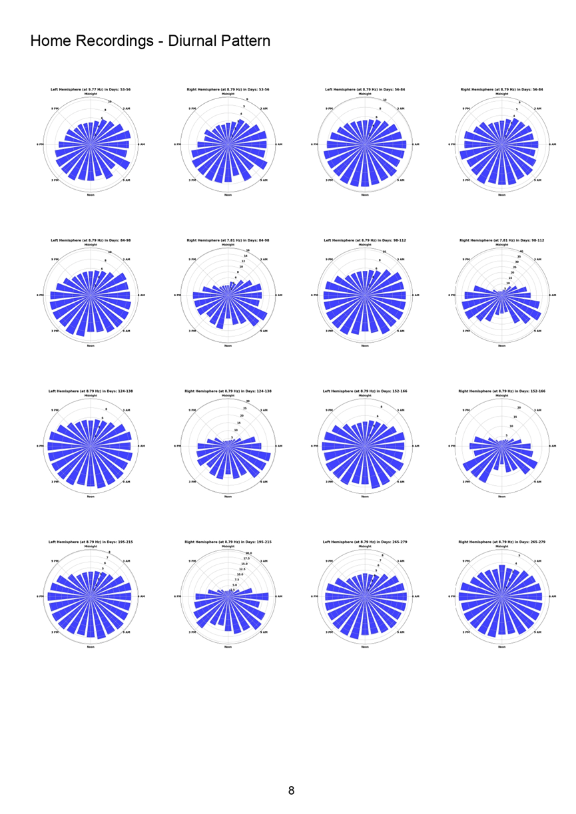  
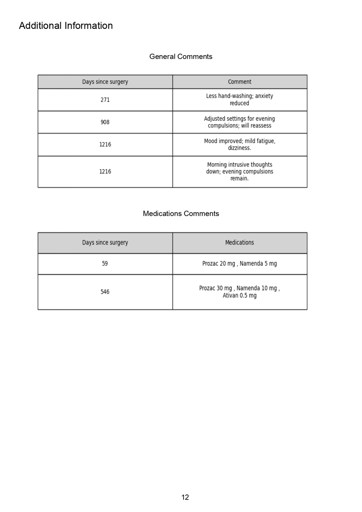
